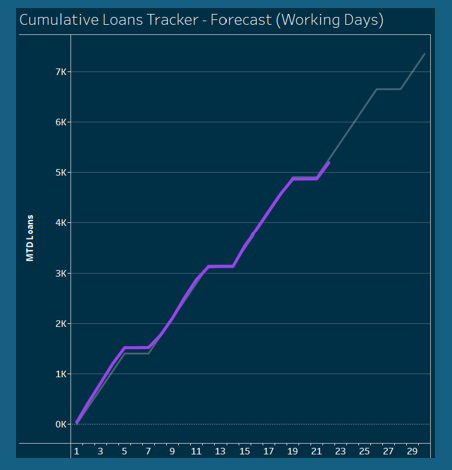

# Bethany Thomas-Smyth - Data Science Proessional Practice

#### Technical Skills: RStudio, SQL

**Tools & Applications**
- RStudio
- Tableau
- Excel

# Tools & Applications

- Linear Regression
  

## Data Science Project
### Executive Summary
Within this project, the key challenges involved working with no data warehouses, unstructured data, getting data from multiple sources which are unreliable data sources. 
Once the reporting has been created, it required communication of those results to non-technical stakeholders from different areas of the business to provide useful insight to each stakeholder.

### Project Background
This project will provide an indication into how the businesses customers are utilising their accounts, currently at NextGear Capital there is just over 1,300 active customers who are all motor industry dealers. 
These dealers have an NGC (NextGear Capital) account, which gives them access to a credit limit that allows them to purchase vehicles for their business. Each dealer will have their own set credit limit, in order to work out how much they are utilising their account would involve having the credit limit figure and the AR (Average Receivables). 
Currently the business has a monthly view of every dealer’s utilisation, but this is a manual process and only provides a snapshot of that point in time it was created.
As the current data process involves extracting data from 2 different data tools – Salesforce & Sopra into an excel spreadsheet, I am wanting to make this new process as automated as possible and provide a daily utilisation view of these dealers, as this will allow the business to make more informed decisions of performance changes against each dealer along with having more meaningful insight, like how the market is changing if we are seeing a change in the typical trend pattern against a high number of dealers.

### Key Objectives
•	Recording the current reporting manual process to replicate and match monthly figures.
•	Documenting previous monthly reports from the relevant stakeholders.
•	Extract, Transform, Create & Distribute the data fields required from the different data sources.
•	Structuring the data through RStudio. 
•	Creating various visualisations of the data through the main data tool – Tableau. 
•	Understanding how valuable this insight will be for the business in regard to financial gain but also being able to enhance the report in the future by applying more granular details within the data sources.

### Data Collection
As some of the data extracts to create this dashboard are already within a data source created by myself, I am then able to re-use that data source within Tableau. There is one set report which is missing from the data source, this is the AR balance from our data tool – Sopra. Therefore, I needed to have this AR balance figure for both UK & IRL dealers, along with the IRL dealers having different currency (GBP & EUR). Not only was this a challenging factor as it will be 3 reports required, I also wanted to create a daily view which means I need to recreate history. It was agreed that I would need to gather the last 12 months of AR balances.

As there was already a monthly snapshot of this created by Finance, I was able to find out the exact reports they were gathering this AR Balance and requested from Sopra an ETL file containing the ‘Day End Reports’ for UK – GBP, IRL – GBP, IRL-EUR. Once received via SFTP, I was able to add these into the primary data location linked to RStudio.

Example of the ‘Day End Report’ –

This report contains details of the dealers but also every vehicle that they purchase which counts towards their AR Balance figure.

### Processing Data
•	Validating data quality through a data quality audit involving the two main data systems - Sopra and Salesforce would typically involve a systematic examination of the data stored within the systems, this would be determining which data records and elements are currently being used within the organisation from customer details to sales transactions.
•	Collecting the data involves extracting a number of pre-built reports from Sopra & Salesforce that includes all the relevant datasets to create the performance report required, along with any other relevant data for future reporting.
•	Analysing the data to understand its structure, quality, and completeness. This also helps with identifying patterns, anomalies and potential issues within the data that are not known.
•	Creating data cleansing processes identify any issues, this may involve correcting errors, deduplication and updating any outdated information within the systems.
•	Validating the data has been cleansed correctly to ensure it meets the quality standards by creating various checks and tests on the accuracy, completeness, and consistency of the data. This will involve comparing to the current report figures and liaising with the relevant stakeholders on the data figures being produced to align with what is expected.
•	Ensuring that the data flow created within the new ETL will process the data correctly and provide continuous monitoring of the data quality within the main systems.
•	Recommendation to stakeholders on improving data quality that is manually processed into the systems – Salesforce and Sopra to establish better data quality monitoring mechanisms.

### Transform
Transforming the data from the multiple extracted excel reports through scripting allows the data to be extracted and transformed by writing code in RStudio, this allows data collections to be mined for information. As for this project, I am going to be using premade excel report extracts which contain a variety of data fields, using RStudio allows me to alter the contents of each of those fields for the purposes of the report but to also structure the data which is a key benefit as this is the most fundamental point of transforming unusable data into usable data. With having full access to RStudio for this project, it allows me to have total control over its modification and security.
