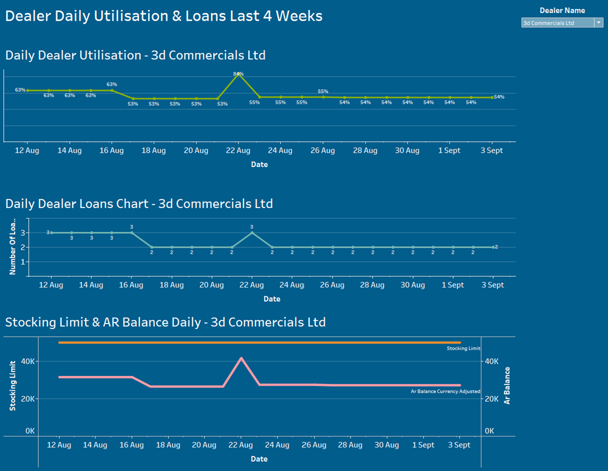
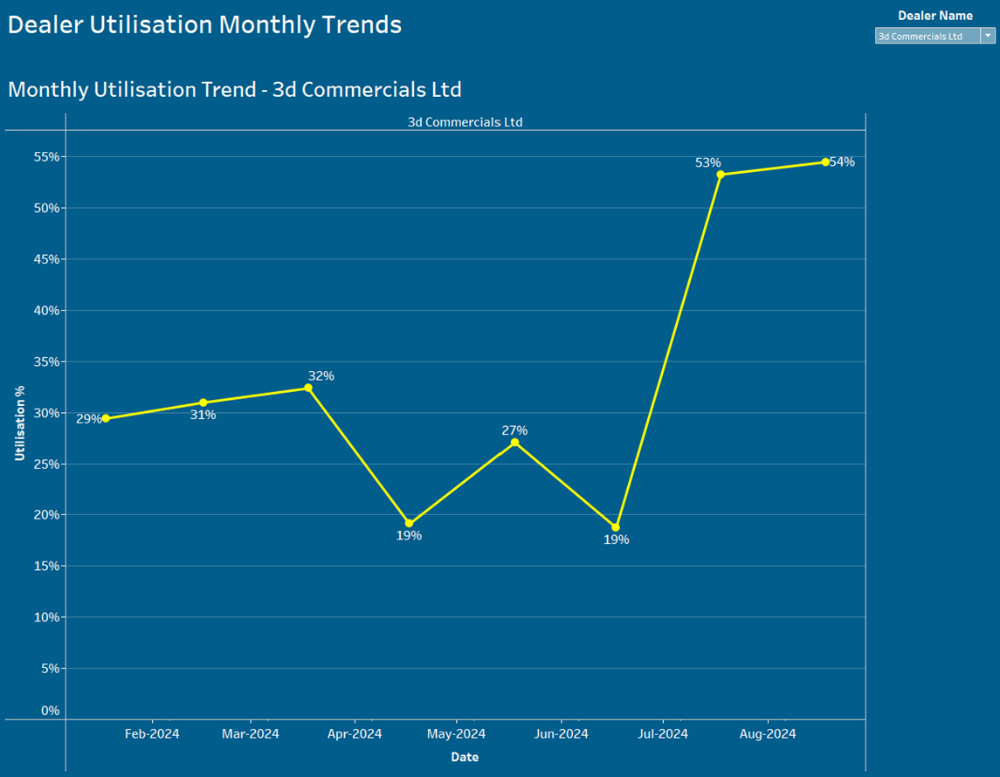
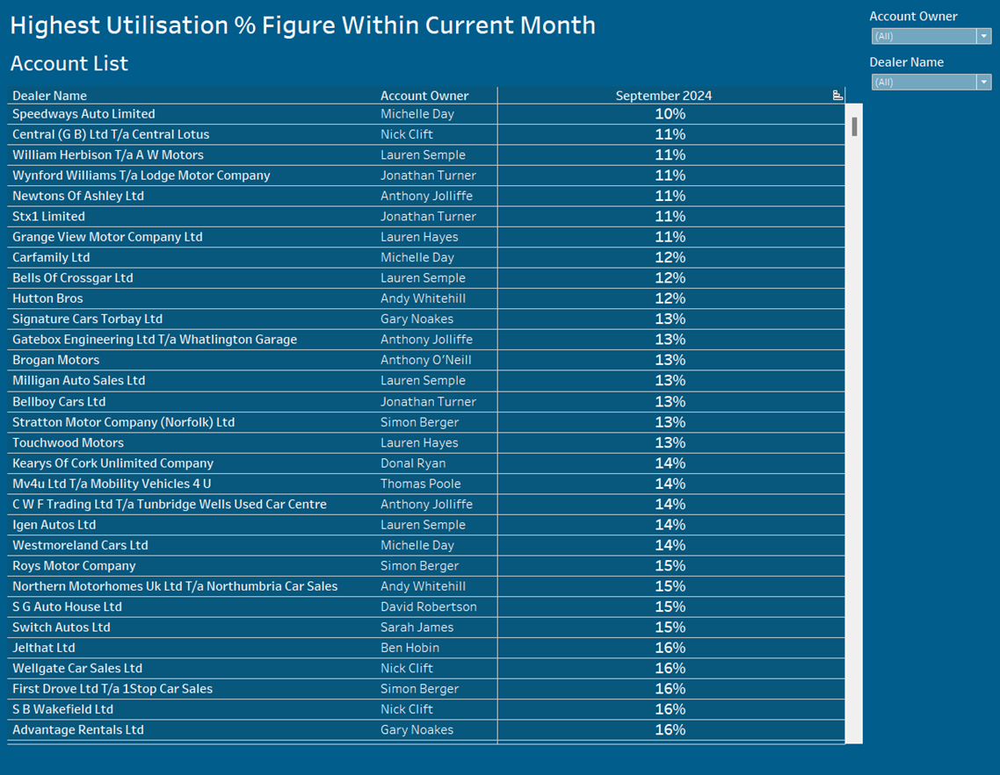

# Bethany Thomas-Smyth - Data Science Professional Practice

#### Manual Extraction and Development of Pre-Made Reports to Migrate into Data Tool

**Tools & Applications**
- RStudio
- Tableau
- Excel

## Data Science Project
### Executive Summary
This project delves into the requirements and process to create a data source within Tableau to create key point analysis with data visualisations, these will be used around the business to make key decisions on performance and to align against forecast and budget figures. The current process is very manual which is why this project will require a few problem-solving tasks to create an output file which will feed to the data source from various premade reports in excel format.
This new data source will be critical to the business as it will be used to create various dashboards which will help enhance key decisions and influence sale decisions.

### Data Infrastructure & Tools
The projects key tool will be RStudio, this is due to it being used for data analysis to import, access, transform and model data. This is what will be required to structure and combine various data sets that are only available within an excel output. The key challenge with using RStudio is that it will only be available to the key individual using this tool to refresh the data source to keep the dashboards up to date, this still has a manual process to it. RStudio is also slower than other programming language tools such as Python due to it taking up a lot of memory. One of the main advantages of using RStudio is that it is very user-friendly, making it more straightforward process to load many files as data to then write the code and manage the data sets. 

### Data Engineering
The data processing includes cleaning all values that is missing or duplicated, as there is a continuous data feed from premade reports in excel, this then has the same records within each file. It is crucial that the creation of the output file has the historical data but does not duplicate that data. It will also merge various other fields from other excel reports that are required, this will be done by a unique identifier within each of the reports to ensure it is merging them correctly. The ETL process (Extract, Transform, Load) from data being within excel to then using RStudio which will load into Tableau is creating a more automated process to have access to data which is accurate and complete.

**Link to RStudio Code** 

### Data Visualisation & Dashboard
Creating an interactive and easy to use dashboard within the data tool Tableau, which provides meaningful insight and real-time business metrics. By using a tool like Tableau, it enables different stakeholders around the business to use for different purposes e.g. Marketing team to use to understand the performance of an incentive that has been applied to the main website. This tool also provides great visualisations that are created for each of those stakeholders to use daily and provide evidence to help make decisions and drive further engagement by making each dashboard interactive for non-technical users.

### Data Analytics
The main data analytics process used was linear regression for trend analysis, this was to showcase the advantage of various incentives on going within the business and if they were producing more sales, and if those sales were of high value. This would provide if those incentives brought through sales but of low value, which were not actually much of a result for the business with the cost of those incentives. The model would look positive to the business, seeing more sales produced daily but would highlight if it has produced more revenue as expected and if any other factors also played a significant role in the performance change.

### Results
Visulisation dashboards were created within Tableau to provide all users meaning insights that were accurate and complete, enabling the dashboards to be easy to use to interactive daily. This provides valuable insight into the business that was not available previously, allowing them to make decisions easily and more time efficiently.
Examples of Visulisation dashboards created -

### Conclusion
By using this type of project approach to create Visulisation dashboards within Tableau, it has shown the business how useful this level of insight can be to provide predictive analytics. This will help to take the next steps in automating the process further by gaining ETL files from the premade report tools and pushing them into a cloud-based data warehouse. This will be more efficient in maintaining the large quantity of data required for the business and remove exporting from excel which minimizes many risks. 

